```{r setup, include=FALSE}
knitr::opts_chunk$set(echo = F, message=F, warning=F, fig.align = "center",  dev='svg')
library(plyr)
library(lattice)
library(lubridate)
library(svglite)

#loading relevant packages
library(zoo) #for rollmean function
library(tidyr)
library(tidyverse) #mainly for reading files functions
library(dplyr)
library(ggplot2) #for ggplot graphs
library(cowplot) #for plot_grid()
library(stringr) #to manipulate strings

theme_set(
  theme_classic() +
  theme(legend.position = "none", 
        legend.title = element_blank(),
        panel.grid.major.y = element_line(),
        text = element_text(family = "Times New Roman"),
        plot.title = element_text(face="bold"),
        axis.title.x = element_blank(),
        axis.title.y = element_blank())
  )
g_theme <- scale_color_manual(values=c('#ff0000','#D8D8D8'))
myred <- '#ff0000'
mygrey <- '#b4b4b4'
#height and width of graphs
w <- 4.5
h <- 5.2
```

```{r loading_true _data}
data_gouv_new_hosp_rea <- 
  read.csv(url("https://www.data.gouv.fr/fr/datasets/r/6fadff46-9efd-4c53-942a-54aca783c30c"), sep=";") %>%
  mutate(date = as.Date(jour))
data_gouv_beds_hosp_rea <- 
  read.csv(url("https://www.data.gouv.fr/fr/datasets/r/63352e38-d353-4b54-bfd1-f1b3ee1cabd7"), sep=";")  %>%
  mutate(date = as.Date(jour))

#Lits occupés en réanimation, hospitalisation et hospitalisation conventionnelle
true_data_beds_hosp_rea <- data_gouv_beds_hosp_rea %>%
  filter(sexe =="0", # 0 = hommes + femmes, 1=hommes, 2=femmes
         #enlève l'Outre-Mer car les scénarios de Pasteur uniquement pour la France Métropolitaine
         dep != 971 & dep != 972 & dep != 973 & dep != 974 & dep != 976 & dep != 978) %>%
  group_by(date) %>% #grouper tous les départements ensembles
  dplyr::summarise(hosp = sum(hosp, na.rm = T), 
            rea = sum(rea, na.rm = T),
            HospConv = sum(HospConv, na.rm = T))

#pour les echos pasteur 29 avril ile de france
true_data_beds_hosp_rea_IDF <- data_gouv_beds_hosp_rea %>%
  filter(sexe =="0", # 0 = hommes + femmes, 1=hommes, 2=femmes
         #enlève l'Outre-Mer car les scénarios de Pasteur uniquement pour la France Métropolitaine
         dep == 75 | dep == 92 | dep == 93 | dep == 94 | dep == 91 | dep == 95 | dep == 78 | dep == 77) %>% 
  group_by(date) %>% #grouper tous les départements ensembles
  dplyr::summarise(hosp = sum(hosp, na.rm = T), 
            rea = sum(rea, na.rm = T),
            HospConv = sum(HospConv, na.rm = T))

#Nouvelles admissions à l'hôpital et en réanimation (moyenné sur 7 jours)
true_data_new_hosp_rea <- data_gouv_new_hosp_rea %>% 
  filter( #enlève l'Outre-Mer car les scénarios de Pasteur uniquement pour la France Métropolitaine
         dep != 971 & dep != 972 & dep != 973 & dep != 974 & dep != 976 & dep != 978) %>% 
  group_by(date) %>% #grouper tous les départements ensembles
  dplyr::summarise(incid_hosp = sum(incid_hosp, na.rm = T), 
            incid_rea = sum(incid_rea, na.rm = T)) %>%
  mutate(new_rea_right = rollmean(incid_rea, 7, na.pad = T, align = "right"),#mean of 7 last days
         new_hosp_right = rollmean(incid_hosp, 7, na.pad = T, align = "right"),
         new_rea_center = rollmean(incid_rea, 7, na.pad = T, align = "center"),#centered mean
         new_hosp_center = rollmean(incid_hosp, 7, na.pad = T, align = "center"))

true_data_new_hosp_rea_no_mean <- data_gouv_new_hosp_rea %>% 
  filter( #enlève l'Outre-Mer car les scénarios de Pasteur uniquement pour la France Métropolitaine
    dep != 971 & dep != 972 & dep != 973 & dep != 974 & dep != 976 & dep != 978) %>% 
  group_by(date) %>% #grouper tous les départements ensembles
  dplyr::summarise(new_hosp = sum(incid_hosp, na.rm = T), 
            new_rea = sum(incid_rea, na.rm = T))

#Pour l'INSERM : admissions hebdomadaire à l'hôpital
true_data_new_hosp_rea_weekly <- data_gouv_new_hosp_rea %>% 
  group_by(date) %>% #je n'ai pas filtré les outre-mer ici car pas précisé, mais ne change pas grand-chose
  dplyr::summarise(incid_hosp = sum(incid_hosp, na.rm = T)) %>%
  mutate(new_hosp_week = rollsum(incid_hosp, 7, na.pad = T, align = "left")) #patients arrivés dans les 7 derniers jours)

```

# Before exploring the modeling scenarios

<details>

<summary>

**What is the point of studying modelling scenarios reliability ?**

</summary>

In the case where the modelling scenarios underestimate the evolution of the epidemic (A), the risk is not to react, or not enough. Conversely, if the scenarios overestimate the evolution of the epidemic (B), the risk is to overreact and in particular to take too many measures with deleterious effects without being justified. Indeed, most of the measures taken to curb the epidemic (lockdown, curfew, school closure, closure of public places) have negative health, social and economic impacts. Therefore, overreacting to the epidemic is not a good thing (nor is under-reacting).

<center>

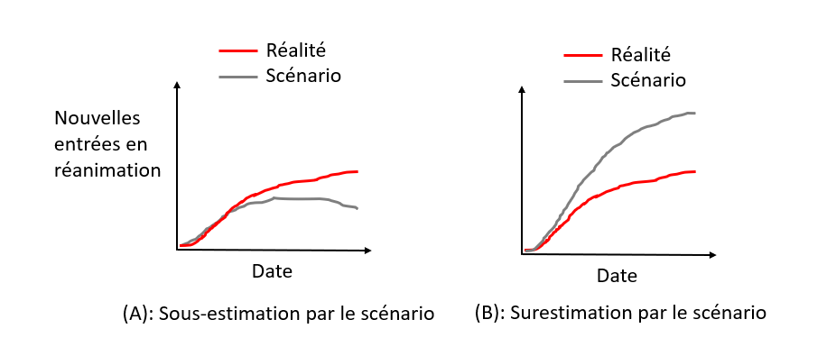{width="800"}

</center>

A more detailed explanation is available on the [Impact page](impact.html).

</details>

<details>

<summary>

**Isn't the point of modeling to prevent worst-case scenarios from happening ?**

</summary>

An common argument about modelling scenarios is that since the scenario anticipates the worst, it leads to measures being taken that will prevent the modelled scenario from occurring, which explains the discrepancy between the modelled scenario and reality (where measures have been taken!). Indeed, it is not possible to establish a comparison in this case.

<center>

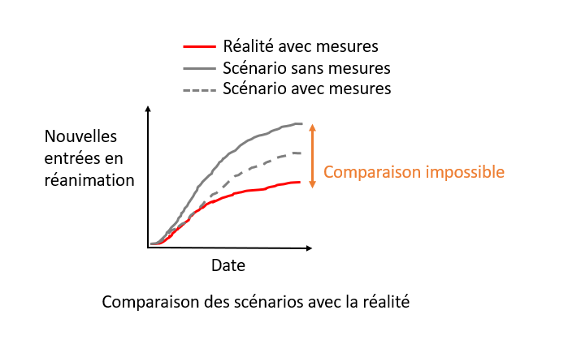{width="500"}

</center>

However, modeling scenarios often incorporate several assumptions about the  measures that could be implemented. Here, we will only compare reality with scenarios where the implemented measures were also modeled.

<center>

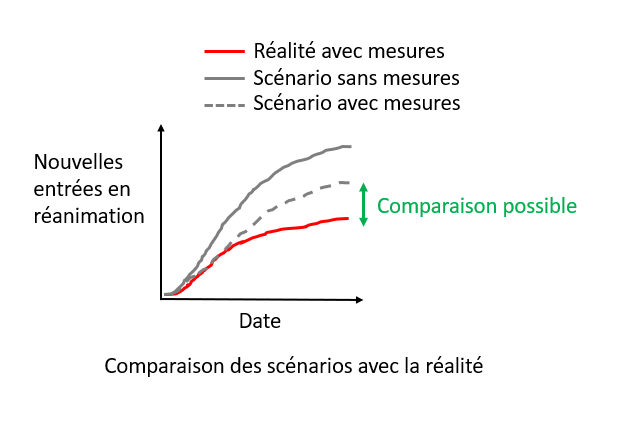{width="500"}

</center>

Thus, the comparison between modeling scenarios and reality will make it possible to evaluate whether they have correctly anticipated reality.

</details>

# Review of the main modeling scenarios

## 1. March 2020, the model that led the world towards lockdown

<details>

<summary>

**Context**

</summary>

By March 2020, there was a great deal of uncertainty about the impact that covid-19 would have. When Italy began to be heavily affected in mid-March, many European countries realized that covid-19 was likely to have significant consequences. To anticipate the evolution of the pandemic, policy-makers turned to the field of epidemiological modelling.

A team of scientists from Imperial College (London), led by Professor Neil Ferguson, published on March 16 the [report](https://www.imperial.ac.uk/mrc-global-infectious-disease-analysis/covid-19/report-9-impact-of-npis-on-covid-19/) that led many European governments, including the [French government](https://www.lemonde.fr/planete/article/2020/03/15/coronavirus-les-simulations-alarmantes-des-epidemiologistes-pour-la-france_6033149_3244.html), to implement lockdowns. The scenarios presented in the report anticipated, without any measures, about 500,000 deaths in less than 3 months in the UK, and similar figures for France. Implementing standard measures such as planned in pandemic preparedness (mitigation strategy) plans would yield 250 000 deaths. The report argued that only the implementation of stricter measures to suppress the virus (such as lockdown) would allow the wave to be contained and that it would be the only way to avoid saturating the hospital system. Relying on this report, many governments have chosen to implement lockdown-style strategies.

Of course, projections of what would happen in the absence of measures cannot be compared with what actually happened in a country that implemented a lockdown. This is one of the most common counter-arguments to the critics of epidemiological models: it is precisely because of the measures that the modelling scenarios did not come true.

But there is one country that allows us to test the validity of the modeling scenarios: Sweden. In the first wave, Sweden chose not to confine itself, preferring to rely on lighter measures. It is therefore possible to compare what the scenarios for Sweden predicted and what actually happened.

</details>

<details>

<summary>

**Comparison of scenarios to real data**.

</summary>

[The appendix](https://www.imperial.ac.uk/media/imperial-college/medicine/mrc-gida/Imperial-College-COVID19-Global-unmitigated-mitigated-suppression-scenarios.xlsx) of the Imperial College [report 12](https://www.imperial.ac.uk/mrc-global-infectious-disease-analysis/covid-19/report-12-global-impact-covid-19/), published on March 26, contains models of the epidemic in all countries, including Sweden.

The first 2 graphs represent the peak occupancy of ICU and hospital beds. The gray bars represent the Imperial College scenarios: early strict lockdown, late strict lockdown, and no action. The red bar represents the reality. Since Sweden has implemented social distancing measures without imposing lockdown, the observed numbers should have been somewhere between the "lockdown" and "no restrictions" scenarios. The reality is quite different. Even though Sweden did NOT implement lockdown, the scenarios WITH lockdown overestimate the peak of used beds by a factor 2 to 10. A scenario with some restrictions should be between lockdown and no restrictions scenarios, yielding a overestimation by a factor 10 to 60.

The last graph shows the different Imperial College scenarios for mortality in grey, and the actual number of deaths in red. Here again, the scenarios greatly overestimate mortality. The actual number of deaths corresponds to the early lockdown scenario, which was obviously not the approach taken by Sweden. The intermediate scenarios of social distancing overestimate mortality by a factor 3 to 7.

</details>

### {.tabset .tabset-fade .tabset-pills}

```{r test}
# temp <- read_csv("data/2020_03_26_Imperial_Sweden/Sweden_Imperial_deaths.csv")
# temp$NPI <- as.factor(temp$NPI)
# temp$NPI <- ordered(temp$NPI, levels = c(
#   "Suppression forte (confinement)",
#   "Distanciation renforcée des plus âgés",
#   "Distanciation sociale de toute la population",
#   "Aucune mesure",
#   "Réalité"))
# ggplot(temp) + geom_col(aes(number, deaths, fill = scenario)) + 
#   facet_grid(~NPI, switch = "x", labeller = label_wrap_gen(width=10)) +
#     theme(axis.title.x=element_blank(),
#         axis.text.x=element_blank(),
#         axis.ticks.x=element_blank()) +
#   scale_fill_manual(values = c("reality" = myred,
#                                "scenario" = mygrey))
                                
```


#### ICU peak

```{r Sweden_Imperial_ICU_peak, echo=FALSE, out.width="500px"}
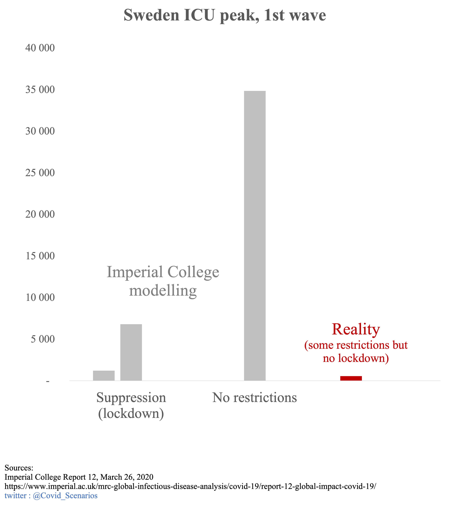
```

#### Hospital peak

```{r Sweden_Imperial_hosp_peak, echo=FALSE, out.width="500px"}
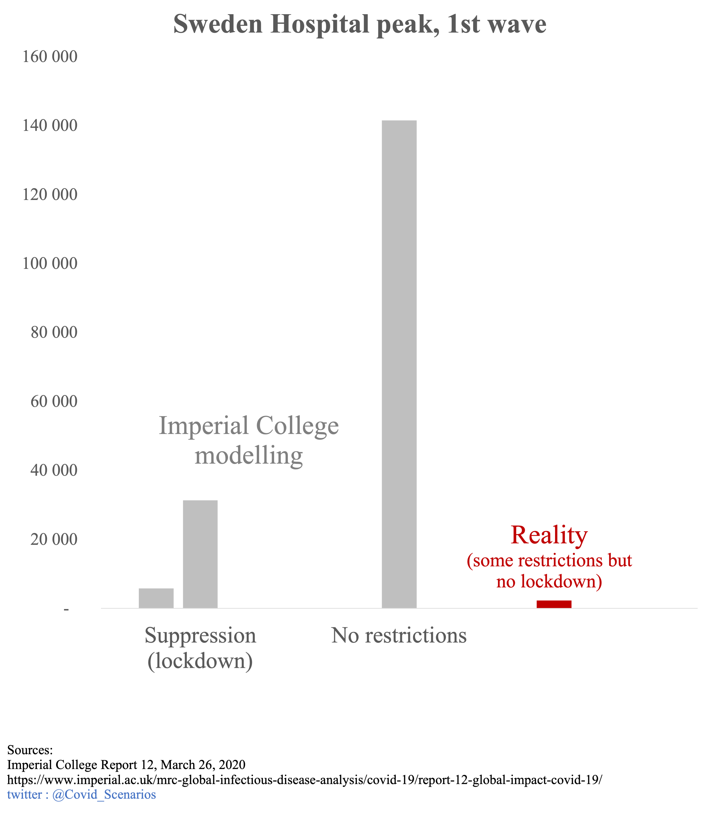
```

#### Deaths

```{r Sweden_Imperial_deaths, echo=FALSE, out.width="500px"}
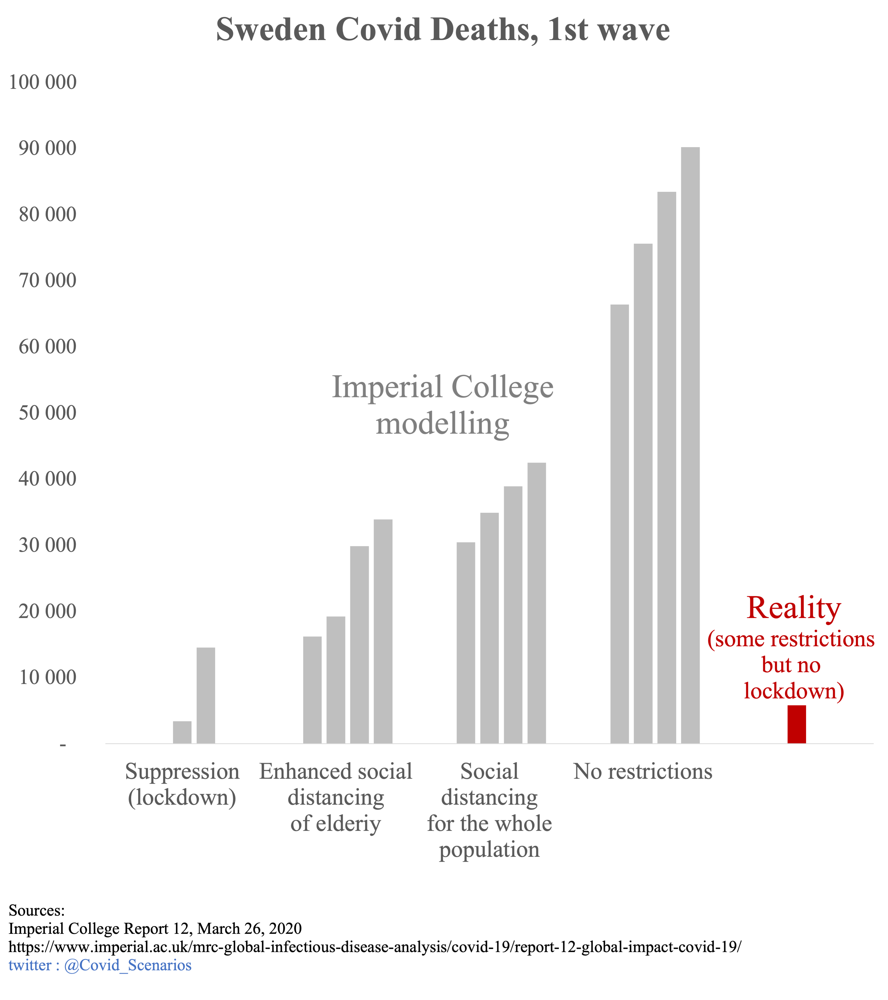
```

###

<details>

<summary>

**Political and media impact**

</summary>

These models were one of the main triggers for the French national lockdown (which will influence other European countries to follow the same path). In its [report of March 12, 2020](https://solidarites-sante.gouv.fr/IMG/pdf/avis_conseil_scientifique_12_mars_2020.pdf), the Scientific Council asserted that the classical measures used to limit the spread of epidemics would not allow to sufficiently limit the circulation of the virus, implying the necessity of a strict confinement. This assertion was based on the Imperial College modelling :

> It is not expected that the reduction in the size of the epidemic peak will be sufficient to avoid saturation of the health system. (...) This intuition was illustrated through the realization of a particular COVID19 model (Neil Ferguson, personal communication)
>
> Extract from the report of the Scientific Council of March 12, 2020

Since the figure above shows that these models vastly overestimated what would happen with conventional disease control measures, this claim is likely to be challenged.

The political influence of these models continues long after March 2020. When in July 2021 the Spanish Constitutional Court declared the first lockdown unconstitutional, [the Minister of Justice countered by assuring that it had saved 450,000 lives in Spain](https://www.lamoncloa.gob.es/lang/en/presidente/news/Paginas/2020/20200610control-session.aspx). 

>That is not me talking, but established by independent scientific studies - as a result of this lockdown, 450,000 lives have been saved. We have lost the lives of more than 27,000 fellow countrymen, but we have saved the lives of 450,000 people
>
>President of the Government of Spain, Pedro Sánchez

While the source of this figure is not specified, it does correspond to the pessimistic scenario of the [appendix](https://www.imperial.ac.uk/media/imperial-college/medicine/mrc-gida/Imperial-College-COVID19-Global-unmitigated-mitigated-suppression-scenarios.xlsx) of the [report 12](https://www.imperial.ac.uk/mrc-global-infectious-disease-analysis/covid-19/report-12-global-impact-covid-19/) of Imperial College applied to Spain. The case of Sweden questions this statement. Indeed, had the Swedish government locked down its population, it could have claimed, like the Spanish minister, that its action saved 90,000 people. We know that this is not the case, as the real death toll without lockdownd was 5,000, or 18 times less.

</details>

<details>

<summary>

**Discussion of scenario assumptions (technical)**

</summary>

For fatalities, Imperial College has developed 4 scenarios:

1.  No action
2.  Mitigation: social distancing of the population in a uniform way (40% reduction of contacts)
3.  Mitigation: same as 2. but with increased social distancing of the over 70s (60% reduction in contacts for this category)
4.  Suppression of transmissions (lockdown): expanded and intense social distancing (75% reduction in contact for the entire population).

It is impossible to measure the actual reduction in contact, but mobility data can provide an approximation. In Sweden, the use of workplaces, train stations, and shopping and leisure facilities was reduced by a maximum of 30-45%, and food stores and pharmacies by 10-15%. This seems to confirm that Sweden was not leaning towards scenario 4, but rather towards a slight mitigation. For comparison, in France, the use of workplaces, shops and leisure facilities was reduced by 70-90% and food stores by 50%, which is in line with scenario 4 of lockdown.

<center>

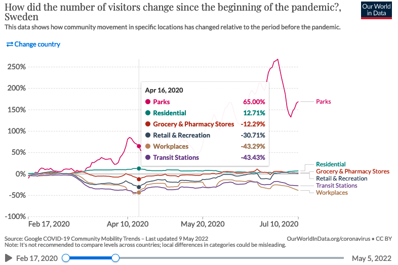{width="500"}

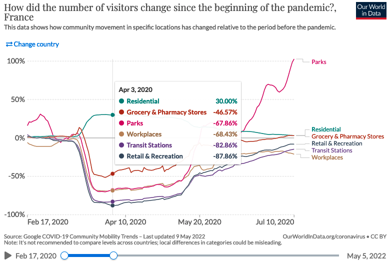{width="500"}

</center>

Although not corresponding to reality, we have chosen to represent the "no action" scenarios for several reasons:

- In the case of intensive care units and hospital peaks, no intermediate scenario was produced, only the "lockdown" and "no restrictions" scenarios. Presenting these 2 scenarios allows to imagine where the reality should have been, somewhere between the two.

- Although unrealistic, the "no action" projections are often put forward as a counterfactual to the absence of lockdown, as illustrated by the case of the hospital peak mentioned above. This is also the case in the press (figure of [500,000 deaths in the UK](https://www.bfmtv.com/international/coronavirus-en-angleterre-les-projections-effrayantes-du-nombre-de-morts-en-cas-de-laisser-faire_AN-202003180090.html)) or by politicians (figure of [450,000 people saved](https://www.courrierinternational.com/article/forme-espagne-un-confinement-juge-inconstitutionnel-des-milliers-damendes-remboursees) according to the Spanish Minister of Justice). This [article by BFM](https://www.bfmtv.com/international/coronavirus-en-angleterre-les-projections-effrayantes-du-nombre-de-morts-en-cas-de-laisser-faire_AN-202003180090.html) even states that a mitigation strategy is a "laissez-faire" strategy :

>By "laissez-faire," researchers mean so-called mitigation measures, such as quarantining identified Covid-19 cases and their relatives and closing schools

</details>

## 2. April 2020, Île-de-France lockdown exit

<details>

<summary>

**Context**

</summary>

On April 29, 2020, during the first lockdown, [an article in the newspaper Les Echos](https://www.lesechos.fr/idees-debats/editos-analyses/pourquoi-philippe-a-douche-les-francais-1199309) reported on unreleased models from the Pasteur Institute. These models were about the evolution of the epidemic post-lockdown. The Ministry of Health indicated that these models were not finalized and were being analyzed, and therefore could not be made public for the moment. To our knowledge, they have not been made public subsequently.

</details>

<details>

<summary>

**Comparison of scenarios to real data**

</summary>

At the end of June, the most optimistic scenario overestimates the actual data by 66%. The median and pessimistic scenarios are 3.5 and 9 times above reality.

</details>

```{r 2020_04_29_Pasteur}
scenario <- read.csv("data/2020_04_29_Pasteur/beds_rea.csv", sep=";") %>%
  mutate(date = as.Date(date, format = "%d/%m/%Y", optional = T))

scenario %>%
  gather(key=scenarios, value = value, -date) %>%
  ggplot(aes(date, value, group=scenarios, color="scénarios")) + geom_smooth(se=F) + 
  geom_line(data= true_data_beds_hosp_rea_IDF, 
            aes(x=date, y=rea, color = "réalité", group="réalité"), size=1) +
  annotate('text', x = as.Date("2020-03-27"), y = 500, label = "reality", color = myred, fontface = "bold",
           family = "Times New Roman") +
  annotate('text', x = as.Date("2020-06-01"), y = 1500, label = "scenarios", color = mygrey, fontface = "bold",
           family = "Times New Roman") +
  xlim(date("2020-03-19"), date("2020-06-28")) + g_theme +
  labs(title = "Intensive Care Unit Beds, Ile-de-France Regions",
       subtitle = "unpublished scenarios from Pasteur Institute, reported in Les Echos \n",
       caption = "\ntwitter : @Covid_Scenarios")
```

<details>

<summary>

**Impact politique et médiatique**

</summary>

Although the report that led to these models has not, to our knowledge, been made public, they have nevertheless been communicated to the press and the government, as reported in the article in Les Echos:

> It is perhaps the modelling carried out by the Pasteur Institute for the ARS Ile-de-France and the AP-HP - by Professor Simon Cauchemez - that invites the government to be cautious. Dated Tuesday and for internal use, they show that the number of patients in intensive care will remain high for a long time, at least until the summer. And that whatever the scenarios.

The confidentiality of the report from which these curves were taken raises the question of the transparency of the models. Similarly, the [Scientific Council report of March 12, 2020](https://solidarites-sante.gouv.fr/IMG/pdf/avis_conseil_scientifique_12_mars_2020.pdf) referred to the Imperial College models used in the report as "Neil Ferguson, personal communication", without additional information.

</details>

<details>

<summary>

**Discussion of scenario assumptions (technical)**

</summary>

As the models are not public, it was not possible for us to study the assumptions of the scenarios. The article in Les Echos simply mentions different reproduction rates for the virus, 1.2, 1.5, or more.

</details>

## 3. November 2020, 2nd wave, and 2nd lockdown

<details>

<summary>

**Context**

</summary>

On October 26, 2020, Pasteur Institute produced scenarios for the evolution of the epidemic in the absence of lockdown. To our knowledge, this report has not been made public, and we have not been able to consult it. We simply found a figure extracted from the report, which can be found on this [page](https://modelisation-covid19.pasteur.fr/realtime-analysis/hospital/).

<center>

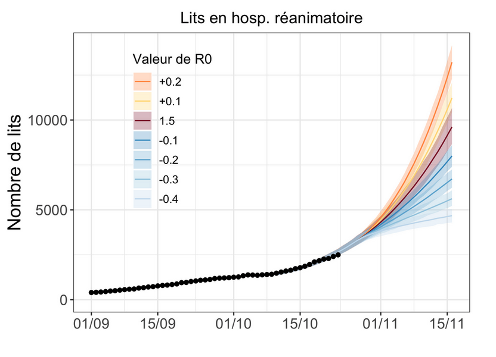{width="400"}

</center>

On October 28, 2020, faced with the prospect presented by these figures, Emmanuel Macron announced a generalized lockdown, which would take effect on October 30.

On October 30, the Institut Pasteur produced an update of its scenarios to take into account the impact of lockdown. The report has not been made public to our knowledge. However, some media have had access to it, and have reproduced the scenarios. [The article from Les Echos](https://www.lesechos.fr/economie-france/social/covid-la-decrue-dans-les-services-de-reanimation-esperee-en-france-dans-une-dizaine-de-jours-1261656) is our source for our graphics.

</details>

<details>

<summary>

**Comparison of scenarios to real data**

</summary>

The most optimistic scenario is close to the actual peak of occupied ICU beds (+15%). The median and most pessimistic scenarios are at +30% and +100%.

</details>

### {.tabset .tabset-fade .tabset-pills}

#### ICU peak

```{r 2020_10_30_Pasteur_ICU_beds}
#Lits de réanimation
scenario <- read.csv("data/2020_10_30_Pasteur/beds_rea.csv", sep=";") %>%
  mutate(date = as.Date(date, format = "%d/%m/%Y", optional = T))
scenario %>%
  gather(key=pasteur, value = value, -date) %>%
  ggplot(aes(date, value-200, group=pasteur, color="scénarios")) + geom_smooth(se=F) + 
  geom_line(data= true_data_beds_hosp_rea, 
            aes(x=date, y=rea, color = "réalité", group="true data"), size = 1) +
  annotate('text', x = as.Date("2020-10-18"), y = 1400, label = "reality", color = myred, fontface = "bold",
           family = "Times New Roman") + 
  annotate('text', x = as.Date("2020-11-10"), y = 7000, label = "scenarios", color = mygrey, fontface = "bold",
           family = "Times New Roman") + 
  xlim(as.Date("2020-10-15"), as.Date("2020-12-10")) + g_theme  +
  labs(title = "Intensive Care Unit Beds",
       subtitle = "Pasteur Institute scenarios of October 30, 2020\nunpublished but reported in Les Echos",
       caption = "\ntwitter : @Covid_Scenarios")
```

#### ICU admissions

```{r 2020_10_30_Pasteur_ICU_adm}
#Admissions en réanimation
scenario <- read.csv("data/2020_10_30_Pasteur/new_rea.csv", sep=";") %>%
  mutate(date = as.Date(date, format = "%d/%m/%Y", optional = T))
scenario %>%
  gather(key=pasteur, value = value, -date) %>%
  ggplot(aes(date, value-30, group=pasteur, color="scénarios")) + geom_smooth(se=F) +
  geom_line(data= true_data_new_hosp_rea, 
            aes(x=date, y=new_rea_center, color = "réalité", group="réalité"), size = 1) +
  annotate('text', x = as.Date("2020-10-18"), y = 170, label = "reality", color = myred, fontface = "bold",
           family = "Times New Roman") + 
  annotate('text', x = as.Date("2020-10-28"), y = 500, label = "scenarios", color = mygrey, fontface = "bold",
           family = "Times New Roman") + 
  xlim(as.Date("2020-10-15"), as.Date("2020-12-10")) + g_theme +
  labs(title = "Intensive Care Unit Admissions",
       subtitle = "Pasteur Institute scenarios of October 30, 2020\nunpublished but reported in Les Echos",
       caption = "\ntwitter : @Covid_Scenarios")
```

###

<details>

<summary>

**Political and media impact**

</summary>

The modelling of October 26 was one of the triggers for the 2nd lockdown. Notably, [during his October 28 speech](https://www.vie-publique.fr/discours/276951-emmanuel-macron-28102020-covid-19), Emmanuel Macron announced that the number of patients in intensive care would exceed 9000 "whatever we do". The actual peak will be half that number, at about 4800 critical care beds. It can be seen that in order to justify a political decision, only the most pessimistic model was put forward by the executive. It was also presented as a certainty, even though it was only one scenario among others.

These models were also widely reported in the press: ["Second wave: worrying scenarios"](https://www.tf1info.fr/sante/video-deuxieme-vague-les-scenarios-qui-inquietent-2168899.html) was the headline on LCI after the announcement of the second lockdown, presenting scenarios with ICU peak levels of 5,500, 6,200 and 9,000 patients.

</details>

<details>

<summary>

**Discussion of scenario assumptions (technical)**

</summary>

As the report has not been made public, it has not been possible for us to explore the assumptions of the scenarios in details. According to the elements reported by Les Echos, the different scenarios correspond to different values of reproduction rate "R" from 0.7 to 1.2, reflecting a more or less marked efficiency of the lockdown.

</details>

## 4. Winter 2021, extended curfew

<details>

<summary>

**Context**

</summary>

During the winter 2020-2021 marked by an extended curfew, a deterioration of the health situation led Inserm and the Pasteur Institute to publish modelling scenarios from mid-January to mid-February. These scenarios were used as a basis to consider the implementation of a strict lockdown in early February, which did not take place in the end, offering the possibility to compare the projections with what actually happened.

The first regional lockdowns were implemented on March 20, followed later by others until the national lockdown on April 3. The latency between the implementation of measures and their effect on hospitalizations being at least one week, and even 2 to 3 weeks as indicated by the [scientific council report](https://solidarites-sante.gouv.fr/IMG/pdf/avis_conseil_scientifique_12_mars_2020.pdf) ("the first effects of the measures adopted [...] can only appear after two to three weeks"), we stop our graph at March 27. Beyond that point, it is no longer legitimate to compare the dynamics of the pandemic to the "no lockdown" scenarios.

Before these dates, a number of measures unlikely to impact the national dynamics of the epidemic were taken: on 25 February weekend lockdown in Dunkerque and part of the Alpes-Maritimes, and on 4 March weekend lockdown in Pas-de-Calais, as well as closed shopping centers of more than 10,000 m2.

</details>

<details>

<summary>

**Comparison of scenarios to real data: Inserm scenarios**

</summary>

The 1-month scenarios all point to an exponential increase in hospital admissions. The reality will be a slight decrease followed by an increase back to about the initial level. Almost all scenarios exceed 30,000 weekly admissions by mid-March with no sign of slowing down the dynamics, while the reality was around 10,000, i.e. 3 times less. The most optimistic scenario overestimates hospitalizations by a factor of 50-100%.

</details>

### {.tabset .tabset-fade .tabset-pills}

#### January 16 scenarios
```{r 2021_01_16_Inserm}
#16 janvier
scenario <- read.csv("data/2021_01_16_INSERM/weekly_hospital.csv", sep=";") %>%
  mutate(date = as.Date(date, format = "%d/%m/%Y", optional = T))
scenario %>%
  gather(key=scenario, value = value, -date) %>%
  ggplot(aes(date, value+1700, group=scenario, color="scénarios")) + geom_smooth(se=F) +
  geom_line(data= true_data_new_hosp_rea_weekly, 
            aes(x=date, y=new_hosp_week, color = "réalité", group="true data"), size = 1) +
  annotate('text', x = as.Date("2021-01-05"), y = 7000, label = "reality", color = myred, fontface = "bold",
           family = "Times New Roman") + 
  annotate('text', x = as.Date("2021-02-01"), y = 25000, label = "scenarios", color = mygrey, fontface = "bold",
           family = "Times New Roman") + 
  #confinement de 16 départements le 20 mars cf https://fr.wikipedia.org/wiki/Chronologie_de_la_pand%C3%A9mie_de_Covid-19_en_France
  #2 semaines pour voir les effets sur hospitalisations. correspond aussi au confinement général du 3 avril
  xlim(date("2021-01-01"), date("2021-03-27")) + ylim(0,37000) + g_theme +
  labs(title = "Weekly number of hospital admissions",
       subtitle = "scenarios published by INSERM on January 16, 2021\n",
       caption = "\ntwitter : @Covid_Scenarios")
```

#### February 2 scenarios

```{r 2021_02_02_Inserm}
#2 février
scenario <- read.csv("data/2021_02_02_INSERM/new_hosp_INSERM.csv", sep=";") %>%
  mutate(date = as.Date(date, format = "%d/%m/%Y", optional = T))
scenario %>%
  gather(key=scenario, value = value, -date) %>%
  ggplot(aes(date, value+1700, group=scenario, color="scenarios")) + geom_smooth(se=F) +
  geom_line(data= true_data_new_hosp_rea_weekly, 
            aes(x=date, y=new_hosp_week, color = "réalité", group="réalité"), size = 1) +
  annotate('text', x = as.Date("2021-01-05"), y = 7000, label = "reality", color = myred, fontface = "bold",
           family = "Times New Roman") + 
  annotate('text', x = as.Date("2021-02-15"), y = 25000, label = "scenarios", color = mygrey, fontface = "bold",
           family = "Times New Roman") + 
  #confinement de 16 départements le 20 mars cf https://fr.wikipedia.org/wiki/Chronologie_de_la_pand%C3%A9mie_de_Covid-19_en_France
  #2 semaines pour voir les effets sur hospitalisations. correspond aussi au confinement général du 3 avril
  xlim(date("2021-01-01"), date("2021-03-27")) + ylim(0,37000) + g_theme +
  labs(title = "Weekly number of hospital admissions",
       subtitle = "scenarios published by INSERM on February 2, 2021\n",
       caption = "\ntwitter : @Covid_Scenarios")
```

#### February 14 scenarios

```{r 2021_02_14_Inserm}
#14 février
scenario <- read.csv("data/2021_02_14_INSERM/weekly_hospital.csv", sep=";") %>%
  mutate(date = as.Date(date, format = "%d/%m/%Y", optional = T))
scenario %>%
  gather(key=scenario, value = value, -date) %>%
  ggplot(aes(date, value+1700, group=scenario, color="scénarios")) + geom_smooth(se=F) +
  geom_line(data= true_data_new_hosp_rea_weekly, 
            aes(x=date, y=new_hosp_week, color = "réalité", group="réalité"), size = 1) +
  annotate('text', x = as.Date("2021-01-05"), y = 7000, label = "reality", color = myred, fontface = "bold",
           family = "Times New Roman") + 
  annotate('text', x = as.Date("2021-02-27"), y = 25000, label = "scenarios", color = mygrey, fontface = "bold",
           family = "Times New Roman") + 
  #confinement de 16 départements le 20 mars cf https://fr.wikipedia.org/wiki/Chronologie_de_la_pand%C3%A9mie_de_Covid-19_en_France
  #2 semaines pour voir les effets sur hospitalisations. correspond aussi au confinement général du 3 avril
  xlim(date("2021-01-01"), date("2021-03-27")) + ylim(0,37000) + g_theme +
  labs(title = "Weekly number of hospital admissions",
       subtitle = "scenarios published by INSERM on February 14, 2021\n",
       caption = "\ntwitter : @Covid_Scenarios")
```

###

<details>

<summary>

**Comparison of scenarios to real data: Pasteur Institute scenarios**

</summary>

For the February 8 report, the 2 main scenarios extending into March reflect a "no vaccination" hypothesis and an "optimistic" vaccination hypothesis. It is specified that "in practice, the impact of the current campaign is likely to be intermediate between the scenarios with and without vaccination", hence our choice to represent these 2 curves. Later in the report, two other secondary variations are presented to illustrate the influence of a small variation in the reproduction rate: these are the curves stopping in March. We stopped their curves here since they explored the hypothesis of a lockdown starting late February, which did not happen.

Only the most optimistic scenario fits reality, although it was not the main scenario presented to the decision makers. The others overestimate actual admissions by a factor of 50-100%.

For the February 23 report, the scenarios presented are generally consistent with observation. No mention is made of the discrepancy observed between reality and the main scenarios published 15 days earlier.

</details>

### {.tabset .tabset-fade .tabset-pills}

#### February 8 scenarios

```{r 2021_02_08_Pasteur}
# February 8 2021
scenario <- read.csv("data/2021_02_08_Pasteur/new_hosp.csv", sep=";") %>%
  mutate(date = as.Date(date, format = "%d/%m/%Y", optional = T))
#Admissions à l'hôpital
scenario %>%
  gather(key=pasteur, value = value, -date) %>%
  ggplot(aes(date, value-100, group=pasteur, color="scénarios")) + geom_smooth(se=F) + 
  geom_line(data= true_data_new_hosp_rea, 
            aes(x=date, y=new_hosp_right, color = "réalité", group="réalité"), size = 1) +
  annotate('text', x = as.Date("2021-01-15"), y = 1100, label = "reality", color = myred, fontface = "bold",
           family = "Times New Roman") + 
  annotate('text', x = as.Date("2021-03-01"), y = 2500, label = "scenarios", color = mygrey, fontface = "bold",
           family = "Times New Roman") + 
  #confinement de 16 départements le 20 mars cf https://fr.wikipedia.org/wiki/Chronologie_de_la_pand%C3%A9mie_de_Covid-19_en_France
  #2 semaines pour voir les effets sur hospitalisations. correspond aussi au confinement général du 3 avril
  xlim(date("2021-01-10"), date("2021-03-27")) + g_theme +
  labs(title = "Daily number of hospital admissions",
       subtitle = "scenarios published by Pasteur Institute on February 8, 2021\n",
       caption = "\ntwitter : @Covid_Scenarios")
```

#### February 23 scenarios

```{r 2021_02_23_Pasteur}

#February 23 2021
#besoin de réaligner leurs données sur la réalité (ne compte surement pas exactement la meme chose)
scenario <- read.csv("data/2021_02_23_Pasteur/new_hosp.csv", sep=";") %>%
  mutate(date = as.Date(date, format = "%d/%m/%Y", optional = T))

#Admissions à l'hôpital
scenario %>%
  gather(key=pasteur, value = value, -date) %>%
  ggplot(aes(date, value+350, group=pasteur, color="scénarios")) + geom_smooth(se=F) + 
  geom_line(data= true_data_new_hosp_rea, 
            aes(x=date, y=new_hosp_right, color = "réalité", group="réalité"), size = 1) +
  annotate('text', x = as.Date("2021-01-15"), y = 1100, label = "reality", color = myred, fontface = "bold",
           family = "Times New Roman") + 
  annotate('text', x = as.Date("2021-03-01"), y = 900, label = "scenarios", color = mygrey, fontface = "bold",
           family = "Times New Roman") + 
  #confinement de 16 départements le 20 mars cf https://fr.wikipedia.org/wiki/Chronologie_de_la_pand%C3%A9mie_de_Covid-19_en_France
  #2 semaines pour voir les effets sur hospitalisations. correspond aussi au confinement général du 3 avril
  xlim(date("2021-01-10"), date("2021-03-27")) + g_theme +
  labs(title = "Daily number of hospital admissions",
       subtitle = "scenarios published by Pasteur Institute on February 23, 2021\n",
       caption = "\ntwitter : @Covid_Scenarios")
```

###

<details>

<summary>

**Institut Pasteur's self-evaluation**

</summary>

A retrospective assessment of the February 8 report will be made in [a subsequent April 26 report](https://modelisation-covid19.pasteur.fr/loosening/Scenarios_de_levee_des_mesures_de_freinage_20210426.pdf). It states that

> As early as February 8, this model anticipated that the curfew would be effective in containing the circulation of the historical virus but would not prevent a significant increase in hospitalizations in the absence of additional measures.

This statement is accompanied by the figure below. One year into the pandemic, this figure will be the first retrospective comparison officially published by the Pasteur Institute.

However, we could not find such a projection in [the February 8 report](https://modelisation-covid19.pasteur.fr/variant/RapportInstitutPasteur_variants_8fevrier2021.pdf). All those we found are represented on our graphs presented above. 

<center>

{width="500"}

</center>

</details>

<details>

<summary>

**Political and media impact**

</summary>

The INSERM modelling of January 16 explicitly advocates for thougher social distancing measures in its summary :

>"These findings show the need to strengthen social distancing measures"

Strikingly, it acknowledges not taking into account the curfew, a measure whose very target was not to implement a lockdown

>It does not account for the curfew anticipated to 6pm and extended to the national territory on January 16, 2021. The evaluation of this social distancing measure will be performed on epidemic data in the next few weeks. For this reason, we provided a more optimistic scenario assuming a stable epidemic activity. 

You will find more presisions about that on the following part**Discussion of scenario assumptions (technical)*

These results were also presented in a [special report of the Scientific Council](https://solidarites-sante.gouv.fr/IMG/pdf/note_eclairage_variants_modelisation_29_janvier_2021.pdf) studying the implementation of a strict lockdown in early February. 


</details>

<details>

<summary>

**Discussion of scenario assumptions (technical)**

</summary>

About the INSERM scenarios:

- [January 16 report](https://www.epicx-lab.com/uploads/9/6/9/4/9694133/inserm_covid-19-voc_dominance-20210116.pdf): the scenarios correspond to 3 reproduction rates of the historical variant (1, 1.1 and 1.2), coupled with a 50% or 70% more transmissible alpha variant. The curves are taken from Figure 1.

- [report of February 2](https://www.epicx-lab.com/uploads/9/6/9/4/9694133/inserm-covid-19-voc-lockdown-20210202.pdf): the scenarios correspond to 3 reproduction rates of the historical variant (0.9, 1.1 and 1.2) coupled with a more transmissible alpha variant 50%. The curves are the gray curves in Figure 2 (redundant with the curves in Figures 1 and 3).

- [February 14 report](https://www.epicx-lab.com/uploads/9/6/9/4/9694133/inserm_covid-19-voc_socialdistancing-20210214.pdf): 50% more transmissible alpha variant. The transmissibility of the historical virus is not given. In addition to the standard projection, 2 scenarios exploring a variation in the transmission of the historical variant of +/- 10% illustrate a reduction or a reinforcement of the measures. The reality did not correspond to either of these 2 scenarios, but we chose to represent these 2 scenarios so as not to be accused of arbitrary exclusion, since a 10% variation could naturally and randomly occur.

About the Pasteur Institute scenarios:

- [report of February 8](https://modelisation-covid19.pasteur.fr/variant/RapportInstitutPasteur_variants_8fevrier2021.pdf): the scenarios correspond to 3 reproduction rates of the historical variant (0.9, 0.95 and 1), coupled with a 40%, 50% or 70% more transmissible alpha variant. The curves are taken from figures 2a, 6a, 7c

- [report of February 23](https://hal-pasteur.archives-ouvertes.fr/pasteur-03149525): many variations are proposed, because as the report underlines in view of the great uncertainty "a single forecast for the coming months is not possible". In detail, the different hypotheses concern the greater transmissibility of the alpha variant (+40%, 50% or 70%) and a change in the epidemic trajectory (decrease and increase of 8% or 16%) which occurs at different dates (February 22 or March 8). The curves are extracted from figures 2c, 5a, 5c, 5e, stopping at 27 March before the lockdown as explained in the "context" paragraph.

The INSERM report of January 16 deserves clarification, because it says that the effect of the early curfew at 6 pm is not taken into account, but that the most optimistic scenario could reflect the measure. Should we have kept only this one and excluded the other scenarios? Our decision to keep them all was based on several points:

- First, the authors made the choice to represent them, indicating that they themselves validated the relevance of these scenarios. Indeed, they do not hesitate to state that "new hospitalizations should reach about 25,000 between mid-February and early April in the absence of intervention".

- Based on these results, they did not hesitate to give explicit policy recommendations "These results show the need to strengthen social distancing measures" and this even though the curfew, whose very purpose is to avoid more restrictive measures, was not modeled...

- Finally, we see that the scenarios of January 16 are very similar to those of February 2, even though these "effectively integrate all the social distancing measures", indicating that taking into account the curfew does not change much

</details>

## 5. May-June 2021, exit from the 3rd lockdown

<details>

<summary>

**Context**

</summary>

Scenarios were released on [April 26](https://modelisation-covid19.pasteur.fr/loosening/Scenarios_de_levee_des_mesures_de_freinage_20210426.pdf) and [May 21](https://modelisation-covid19.pasteur.fr/loosening/Mise_a_jour_scenarios_de_levee_des_mesures_de_freinage_20210521.pdf), covering epidemic trajectories for the exit from the 3rd lockdown and the summer. We stop the comparisons in mid-June, the time of the delta variant onset, not considered in the models.

For the May 21 report, we did not need to conduct an analysis ourselves. Indeed Simon Cauchemez, in charge of the modeling team of the Institut Pasteur, had already published [an informal comparison on his twitter account](https://twitter.com/SCauchemez/status/1405129313721241603?cxt=HHwWhsC-_dDqgoAnAAAA), reproduced here. To our knowledge, this was not done for the April 26 report, and we have therefore made the comparison ourselves.

</details>

<details>

<summary>

**Comparison of scenarios to actual data**

</summary>

For the first report, the scenarios are above reality in mid-June, with overestimation ranging from a factor 2 to 6.

On the other hand, the observed recession follows faithfully the scenario of the second report, as shown in the screenshot of Simon Cauchemez. He does not mention the discrepancy in the first report.

</details>

### {.tabset .tabset-fade .tabset-pills}

####  April 26 Scenarios

```{r 2021_04_26_Pasteur}
scenario <- read.csv("data/2021_04_26_Pasteur/new_hosp.csv", sep=";") %>%
  mutate(date = as.Date(date, format = "%d/%m/%Y", optional = T))

scenario %>%
  gather(key=pasteur, value = value, -date) %>%
  ggplot(aes(date, value+100, group=pasteur, color="scénarios")) + geom_smooth(se=F) +
  geom_line(data= true_data_new_hosp_rea, 
            aes(x=date, y=new_hosp_right, color = "réalité", group="réalité"), size = 1) +
  annotate('text', x = as.Date("2021-05-20"), y = 400, label = "reality", color = myred, fontface = "bold",
           family = "Times New Roman") + 
  annotate('text', x = as.Date("2021-05-15"), y = 1700, label = "scenarios", color = mygrey, fontface = "bold",
           family = "Times New Roman") +
  xlim(date("2021-03-15"), date("2021-06-15")) + ylim(0,2200) + g_theme +
  labs(title = "Daily hospital admissions",
       subtitle = "scenarios published by Pasteur Institute on April 26, 2021\n",
       caption = "\ntwitter : @Covid_Scenarios")
```

#### May 21 Scenarios

```{r Cauchemez_twitter, echo=FALSE, out.width="400px"}
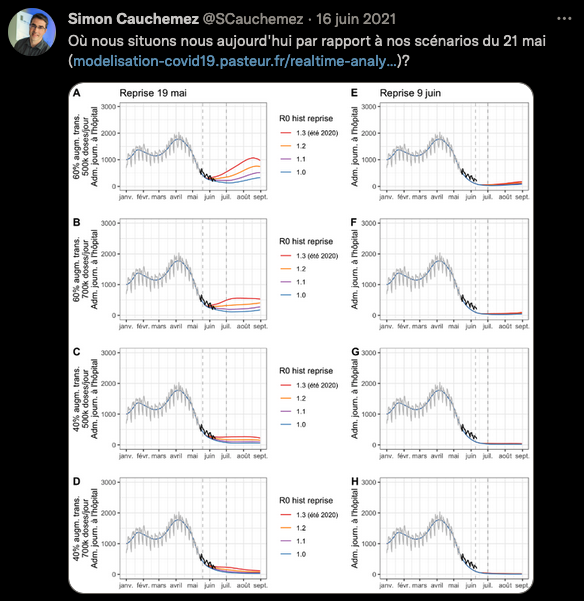
```

###

<details>

<summary>

**Political and media impact**

</summary>

These models supported the [Scientific Council report of May 6, 2021](https://www.vie-publique.fr/sites/default/files/rapport/pdf/279792.pdf). Although the Scientific Council specifies that "These projections [...] are not predictions", it relies on them to estimate that "under plausible assumptions, a significant rebound of the epidemic is possible during the summer period if control measures are relaxed too quickly, even when considering a significant rate of vaccination. This is one of the arguments that pushed the Scientific Council to position itself in favor of a "prudent and controlled" reopening of social activities following the 3rd lockdown.

Several epidemiologists made statements in line with the Pasteur Institute April 26 report. [Here](https://france3-regions.francetvinfo.fr/occitanie/herault/montpellier/deconfinement-mircea-sofonea-epidemiologiste-a-montpellier-on-va-rester-a-5-ou-6000-patients-covid-des-semaines-2064442.html) and [there](https://www.francetvinfo.fr/sante/maladie/coronavirus/confinement/covid-19-il-faut-attendre-au-moins-cinquante-jours-pour-voir-les-hospitalisations-baisser-estime-un-epidemiologiste_4601767.html) for instance, on Apris 27 : 

>It will take at least 50 days to see a drop in hospitalizations
>
>We will remain at 5,000 or 6,000 Covid patients for weeks
>
>Mircea Sofonea, epidemiologist

The decrease occured the next week, and 50 days later (June 15) there were less than 1,000 ICU patients. Other examples can be found on [April 19](https://www.radiofrance.fr/franceinter/podcasts/l-invite-de-7h50/dominique-costagliola-je-ne-vois-pas-comment-on-peut-esperer-une-baisse-massive-des-cas-d-ici-fin-mai-7022253) and [May 5](https://www.lemonde.fr/planete/article/2021/05/05/dominique-costagliola-la-probabilite-d-eviter-une-nouvelle-saturation-totale-de-l-hopital-est-faible_6079142_3244.html)

>I don't see how we can expect a massive drop by the end of May
>
>La probabilité d’éviter une nouvelle saturation totale de l’hôpital est faible 
>
>Dominique Costagliola, epidemiologist


</details>

<details>

<summary>

**Discussion of scenario assumptions (technical)**

</summary>

For the April 26 report, the curves are taken from Figures 3b and 3d. The assumptions made in the scenarios are as follows:

- A 60% or 40% more transmissible alpha variant compared to the original strain

- More or less rapid lifts of the measures, resulting in recovery reproduction rates R from 1 to 1.3, starting May 15. We excluded the most pessimistic scenario (R = 1.3) which corresponded to an almost total lifting of the measures from mid-May, which was not the case.

- Median or pessimistic assumptions regarding the reduction of hospitalizations

- A vaccine distribution rate of 350,000 or 500,000 doses per day. We only kept the 500,000 doses/day scenarios, which are close to reality for May, as shown in the graph below.

<center>

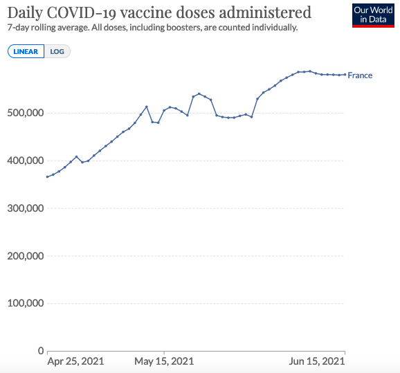{width="500"}

</center>

For the May 21 report, we did not need to check the hypotheses, as Simon Cauchemez himself had compared the epidemic trajectory to his scenarios, and the significant differences only occur after mid-June.

In both cases we stop the comparison in mid-June, when the appearance of the delta variant not predicted by the models renders the hypotheses null and void.

</details>

## 6. August 2021, 4th wave and delta variant

<details>

<summary>

**Contexte**

</summary>

A [first report from the Pasteur Institute came out on July 9, 2021](https://modelisation-covid19.pasteur.fr/variant/Institut_Pasteur_dynamique_du_variant_Delta_en_France_metropolitaine_20210709.pdf) in the context of the delta variant spread. Two out of three scenarios presented anticipated a number of critical care beds by the end of August at least equal to the 2nd wave, and in the absence of measures a peak in September well above the 1st wave.

Faced with the prospect of hospital flooding suggested by these scenarios, the extended sanitary pass was implemented on 21 July, leading to a sharp increase in vaccinations and rendering the hypotheses of the 9 of July report obsolete.

To remedy this, the Institut Pasteur published two new reports, on [July 26](https://modelisation-covid19.pasteur.fr/variant/Institut_Pasteur_Acceleration_vaccination_et_Delta_20210726.pdf) and [August 5](https://modelisation-covid19.pasteur.fr/variant/InstitutPasteur_Dynamiques_regionales_des_hospitalisations_20210805.pdf), to take into account the effect of the sanitary pass. We compare these two reports with the actual trajectory.

</details>

<details>

<summary>

**Comparison of scenarios to actual data**.

</summary>

For the first report, the reality is about 2 times smaller than the most optimistic scenarios, 3 to 4 times smaller than the median scenarios, 10 times smaller than the pessimistic scenarios.

The report published 10 days later partially corrects this overestimation, the reality corresponding approximately to the most optimistic scenario, but remaining 2 times smaller than the median scenario and 4 times smaller than the pessimistic scenario.

</details>

**July 26 Scenarios**

### {.tabset .tabset-fade .tabset-pills}

#### ICU Beds

```{r 2021_07_26_Pasteur_ICU_beds}
scenario <- read.csv("data/2021_07_26_Pasteur/beds_SC.csv", sep=";") %>%
  mutate(date = as.Date(date, format = "%d/%m/%Y", optional = T))
scenario %>%
  gather(key=pasteur, value = value, -date) %>%
  ggplot(aes(date, value+200, group=pasteur, color="scénarios")) + geom_smooth(se=F) + 
  geom_line(data= true_data_beds_hosp_rea, 
            aes(x=date, y=rea, color = "réalité", group="réalité"), size=1) +
  annotate('text', x = as.Date("2021-08-30"), y = 1000, label = "reality", color = myred, fontface = "bold",
           family = "Times New Roman") + 
  annotate('text', x = as.Date("2021-08-25"), y = 9500, label = "scenarios", color = mygrey, fontface = "bold",
           family = "Times New Roman") +
  xlim(as.Date("2021-07-15"), as.Date("2021-10-10")) + g_theme +
  labs(title = "Intensive Care Unit Beds",
       subtitle = "scenarios published by Pasteur Institute on July 26, 2021\n",
       caption = "\ntwitter : @Covid_Scenarios")
```

#### ICU Admissions

```{r 2021_07_26_Pasteur_ICU_adm}

#admissions en soins critiques
scenario <- read.csv("data/2021_07_26_Pasteur/new_SC.csv", sep=";") %>%
  mutate(date = as.Date(date, format = "%d/%m/%Y", optional = T))
scenario %>%
  gather(key=pasteur, value = value, -date) %>%
  ggplot(aes(date, value, group=pasteur, color="scénarios")) + geom_smooth(se=F) + 
  geom_line(data= true_data_new_hosp_rea, 
            aes(x=date, y=new_rea_right, color = "réalité", group="réalité"), size=1) +
  annotate('text', x = as.Date("2021-08-20"), y = 80, label = "reality", color = myred, fontface = "bold",
           family = "Times New Roman") + 
  annotate('text', x = as.Date("2021-08-15"), y = 800, label = "scenarios", color = mygrey, fontface = "bold",
           family = "Times New Roman") +
  xlim(date("2021-07-15"), date("2021-10-10")) + g_theme +
  labs(title = "Daily Intensive Care Unit Admissions",
       subtitle = "scenarios published by Pasteur Institute on July 26, 2021\n",
       caption = "\ntwitter : @Covid_Scenarios")
```

#### Hospital Admissions

```{r 2021_07_26_Pasteur_hosp_adm}
#Nouvelles admissions à l'hôpital
scenario <- read.csv("data/2021_07_26_Pasteur/new_hospital.csv", sep=";") %>%
  mutate(date = as.Date(date, format = "%d/%m/%Y", optional = T))
scenario %>%
  gather(key=pasteur, value = value, -date) %>%
  ggplot(aes(date, value, group=pasteur, color="scénarios")) + geom_smooth(se=F) +
  geom_line(data= true_data_new_hosp_rea, 
            aes(x=date, y=new_hosp_right, color = "réalité", group="réalité"), size = 1) +
  annotate('text', x = as.Date("2021-08-20"), y = 400, label = "reality", color = myred, fontface = "bold",
           family = "Times New Roman") + 
  annotate('text', x = as.Date("2021-08-15"), y = 3200, label = "scenarios", color = mygrey, fontface = "bold",
           family = "Times New Roman") +
  xlim(date("2021-07-15"), date("2021-10-10")) + g_theme +
  labs(title = "Daily Hospital Admissions",
       subtitle = "scenarios published by Pasteur Institute on July 26, 2021\n",
       caption = "\ntwitter : @Covid_Scenarios")
```

###

**August 5 Scenarios**

### {.tabset .tabset-fade .tabset-pills}

#### ICU Beds

```{r 2021_08_05_Pasteur_ICU_beds}
#Lits de soins critiques
scenario <- read.csv("data/2021_08_05_Pasteur/beds_SC.csv", sep=";") %>%
  mutate(date = as.Date(date, format = "%d/%m/%Y", optional = T))
scenario %>%
  gather(key=scenarios, value = value, -date) %>%
  ggplot(aes(date, value, group=scenarios, color="scénarios")) + geom_smooth(se=F) + 
  geom_line(data= true_data_beds_hosp_rea, 
            aes(x=date, y=rea, color = "réalité", group="réalité"), size=1) +
  annotate('text', x = as.Date("2021-07-20"), y = 1200, label = "reality", color = myred, fontface = "bold",
           family = "Times New Roman") + 
  annotate('text', x = as.Date("2021-08-20"), y = 5800, label = "scenarios", color = mygrey, fontface = "bold",
           family = "Times New Roman") +
  xlim(date("2021-07-15"), date("2021-10-10")) + g_theme +
  labs(title = "Intensive Care Unit Beds",
       subtitle = "scenarios published by Pasteur Institute on August 5, 2021\n",
       caption = "\ntwitter : @Covid_Scenarios")
```

#### ICU Admissions

```{r 2021_08_05_Pasteur_IDU_adm}

#Admissions en soins critiques
scenario <- read.csv("data/2021_08_05_Pasteur/new_SC.csv", sep=";") %>%
  mutate(date = as.Date(date, format = "%d/%m/%Y", optional = T))
scenario %>%
  gather(key=pasteur, value = value, -date) %>%
  ggplot(aes(date, value, group=pasteur, color="scénarios")) + geom_line(size=1) +
  geom_line(data= true_data_new_hosp_rea, 
            aes(x=date, y=new_rea_center, color = "réalité", group="réalité"), size=1) +
  annotate('text', x = as.Date("2021-08-15"), y = 120, label = "reality", color = myred, fontface = "bold",
           family = "Times New Roman") + 
  annotate('text', x = as.Date("2021-08-15"), y = 500, label = "scenarios", color = mygrey, fontface = "bold",
           family = "Times New Roman") +
  xlim(date("2021-07-15"), date("2021-10-10")) + ylim(0,600) + g_theme +
  labs(title = "Intensive Care Unit Admissions",
       subtitle = "scenarios published by Pasteur Institute on August 5, 2021\n",
       caption = "\ntwitter : @Covid_Scenarios")
  
```

#### Hospital Admissions

```{r 2021_08_05_Pasteur_hosp_adm}
#Admissions à l'hopital
scenario <- read.csv("data/2021_08_05_Pasteur/new_hosp.csv", sep=";") %>%
  mutate(date = as.Date(date, format = "%d/%m/%Y", optional = T))
scenario %>%
  gather(key=pasteur, value = value, -date) %>%
  ggplot(aes(date, value, group=pasteur, color="scénarios")) + geom_line(size=1) + 
  geom_line(data= true_data_new_hosp_rea, 
            aes(x=date, y=new_hosp_center, color = "réalité", group="réalité"), size=1) +
  annotate('text', x = as.Date("2021-08-05"), y = 400, label = "reality", color = myred, fontface = "bold",
           family = "Times New Roman") + 
  annotate('text', x = as.Date("2021-08-13"), y = 1900, label = "scenarios", color = mygrey, fontface = "bold",
           family = "Times New Roman") +
  xlim(date("2021-07-15"), date("2021-10-10")) + ylim(0,2500) + g_theme +
  labs(title = "Hospital Admissions",
       subtitle = "scenarios published by Pasteur Institute on August 5, 2021\n",
       caption = "\ntwitter : @Covid_Scenarios")
```

###

<details>

<summary>

**Political and media impact**

</summary>

In line with the projections presented, the president of the scientific council [Jean-François Delfraissy predicted a complicated hospital situation for the end of August during his hearing before the senators](https://www.publicsenat.fr/article/parlementaire/covid-19-jean-francois-delfraissy-prevoit-une-situation-tres-complexe-dans-les):

> The model clearly shows that by the end of August, we will find ourselves in a very complex situation, with an impact on the health care system.

This presentation of the Institut Pasteur's projections to the Senate occurred before the Senate voted on the extension of the sanitary pass, and may therefore have played a role in the senators' opinion.

The Institut Pasteur's modelling was also [used by the Conseil d'Etat as an argument](https://www.conseil-etat.fr/content/download/160458/file/454792-454818.pdf) to reject the challenges concerning the extension of the sanitary pass. In rejecting these requests, the Conseil d'Etat explained in particular that

> The data "could be even more worrisome in early August, according to Pasteur Institute's modelling.

Interestingly, the United Kingdom faced the same situation in July: an increase in hospitalizations, accompanied by scenarios suggesting hospital overwhelm. Unlike France, the UK did not implement a sanitary pass and lifted almost all control measures. We detail this in the next section.

</details>

<details>

<summary>

**Discussion of scenario assumptions (technical)**

</summary>

The scenarios from the first report are taken from Figures 4, 5 and 6. Scenarios with assumptions that did not match reality were excluded from the comparison, reducing the number of scenarios from 108 to only 6 for admissions and 12 for the number of occupied beds. Details of assumptions:

- Time spent in critical care units for patients: 14.6 days or 10 days

- R reduction to 1.5, 1.8 or 2 due to social distancing and sanitary pass.

- Vaccine adherence of >60 years: 90 or 95%. We have retained only the 90% scenarios, in line with the graph below.

- Vaccination adherence of 18-59 year olds: 70% or 90%. We have only retained the 90% scenarios, in line with the graph below.

- Vaccine adherence of 12-17 year olds: 30%, 50% 70%. We did not need to test this assumption, because for high adult vaccination coverage (90%), vaccination of adolescents has no impact on the hospital trajectory according to the report's own results.

- Vaccine doses distributed per day: 500,000, 700,000, or 800,000. We have eliminated the 800,000 doses/day scenarios, which are too far from reality (see graph below). The 700,000 scenario may only correspond to the first week of August, but we chose to also keep it alog with the 600,000 scenario..

The second report only makes assumptions about the time spent in critical care (10, 14 or 17 days) and the number of doses of vaccine distributed per day (600,000, 700,000, 800,000). Given the figures below, we have excluded the 700,000 and 800,000 doses/day scenarios.

<center>

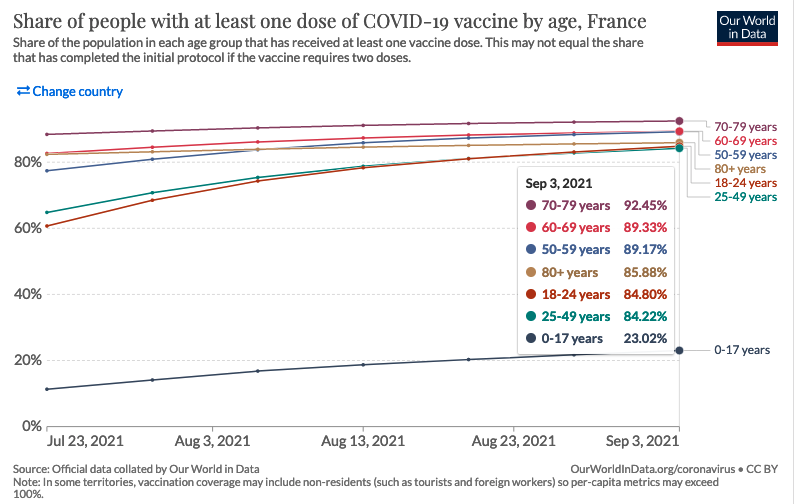{width="600"}

</center>

<center>

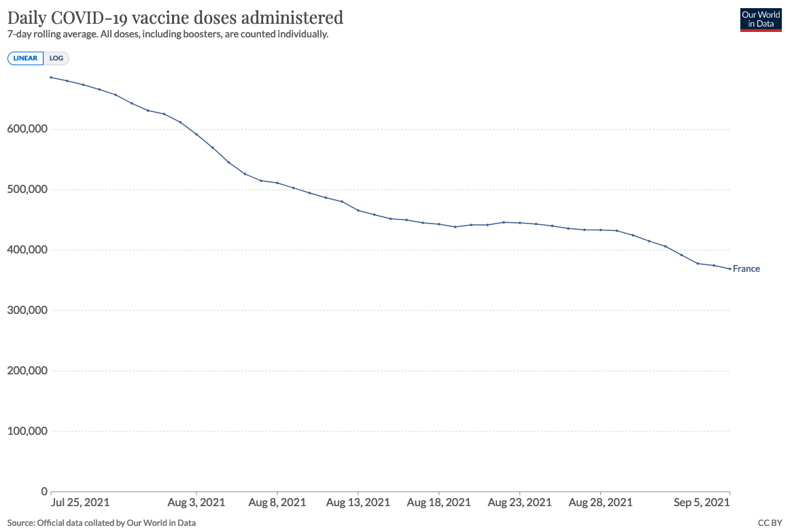{width="600"}

</center>

</details>

## 7. Summer 2021, Freedom Day in the UK

<details>

<summary>

**Context**

</summary>

In July, the United Kingdom faced a similar situation to France: an increase in hospital admissions, accompanied by scenarios anticipating hospital flooding. Unlike France, the UK did not implement a sanitary pass and lifted almost all control measures.

We present a comparison between modeling scenarios and reality in the case of "Freedom Day", the day on which almost all restrictive measures were lifted in the UK. On July 19, as part of its exit plan, the British government decided to [lift most of its restrictive measures](https://news.sky.com/story/covid-19-what-are-the-remaining-rules-in-england-after-freedom-day-12359221) (such as capacity limitations in places open to the public, compulsory wearing of masks or travel restrictions).

</details>

<details>

<summary>

**Comparison of scenarios to actual data**

</summary>

The data presented below compares actual hospitalized patients with different modeling scenarios to predict the impact of lifting restrictions. The data are from the July 7 SAGE (Scientific Advisory Group for Emergencies) [report](https://assets.publishing.service.gov.uk/government/uploads/system/uploads/attachment_data/file/1075065/S1301_SPI-M-O_Summary_Roadmap_second_Step_4.2_1_.pdf), and the formatting is from [The Spectator](https://data.spectator.co.uk/category/sage-scenarios).

The actual peak is below the most optimistic scenario, the median scenarios are 2-3 times higher, and the most pessimistic scenario is more than 5 times higher.

</details>

<center>

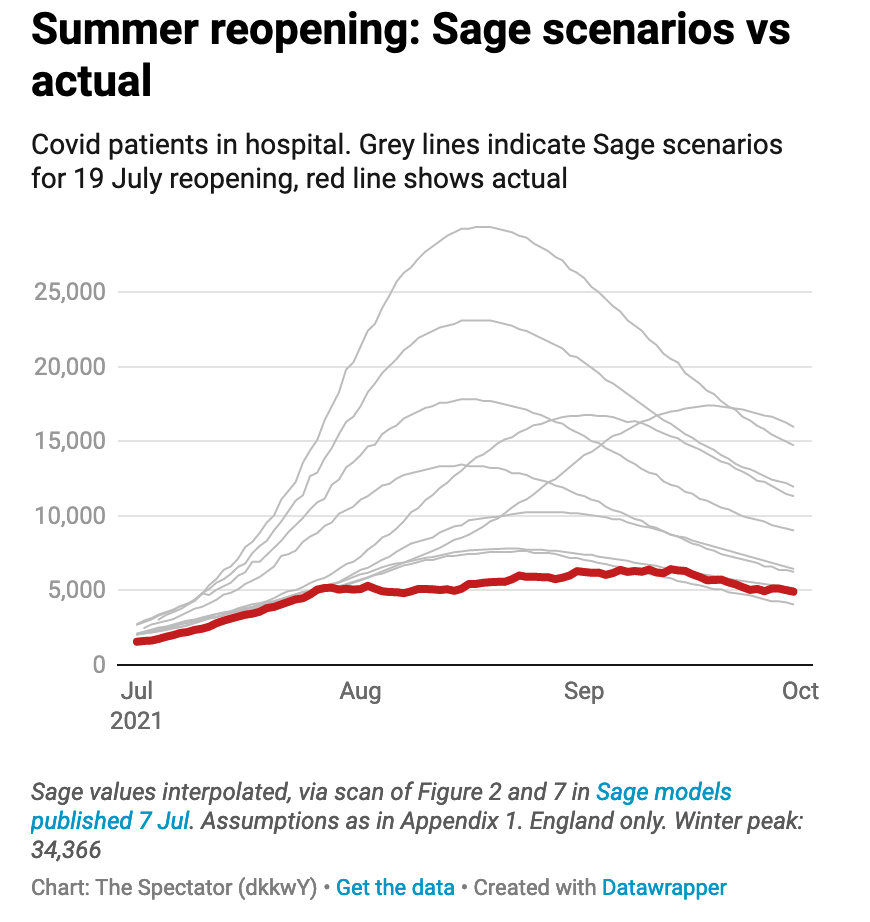{width="500"}

</center>

<details>

<summary>

**Political and media impact**

</summary>

This lifting of restrictions was strongly criticized by many scientists in an open letter to the prestigious medical journal [The Lancet](https://www.thelancet.com/journals/lancet/article/PIIS0140-6736(21)01589-0/fulltext). They called it "dangerous and premature". This open letter was picked up by various [British](https://www.dailymail.co.uk/news/article-9766759/Experts-sign-letter-condemning-Government-s-dangerous-unethical-experiment.html) and [international](https://edition.cnn.com/2021/07/18/uk/boris-johnson-covid-gamble-freedom-day-intl-gbr-cmd/index.html) media outlets, which relied on these models to announce "a third major wave of hospitalizations and deaths" following the lifting of the restrictions, described as a *dangerous and unethical experimen*".

The fact that the models greatly overestimated the impact of the reopening was [described in the scientific journal Nature](https://www.nature.com/articles/d41586-021-02125-1) by a renowned epidemiologist:

> No one really understands what's going on.

</details>

## 8. Fall-Winter 2021, pre-Omicron

<details>

<summary>

**Context**

</summary>

In a context marked by the generalization of the sanitary pass, the Pasteur Institute published models on the epidemic dynamic during the autumn-winter transition. Although the arrival of the Omicron variant made these models obsolete in December, there is still a 2-month period over which they can be compared with reality.

</details>

<details>

<summary>

**Comparison of scenarios to actual data**.

</summary>

Most scenarios are at the level of a contained epidemic circulation, below actual hospital admissions by a factor of 4 to 6.

Scenarios closer to reality correspond to a "relaxation of measures/behaviors by 40%", which returns to the "control level measured in June-July", coupled with an unfavorable climate modulation. Although the control measures were not relaxed to the June-July level, when there was no sanitary pass, it is impossible for us to measure the "relaxation of behaviors", so we kept these scenarios.

</details>

```{r 2021-10-10 Pasteur}

scenario <- read.csv("data/2021_10_04_Pasteur/new_hosp.csv", sep=";") %>%
  mutate(date = as.Date(date, format = "%d/%m/%Y", optional = T))
scenario %>%
  gather(key=pasteur, value = value, -date) %>%
  ggplot(aes(date, value+30, group=pasteur, color="scénarios")) + geom_smooth(se=F) + 
  geom_line(data= true_data_new_hosp_rea, 
            aes(x=date, y=new_hosp_center, color = "réalité", group="réalité"), size=1) +
  annotate('text', x = as.Date("2021-11-28"), y = 1100, label = "reality", color = myred, fontface = "bold",
           family = "Times New Roman") + 
  annotate('text', x = as.Date("2021-12-07"), y = 600, label = "scenarios", color = mygrey, fontface = "bold",
           family = "Times New Roman") +
  xlim(date("2021-09-15"), date("2021-12-20")) + ylim(0,1400) + g_theme +
  labs(title = "Hospital Admissions",
       subtitle = "scenarios published by Pasteur Institute on October 4, 2021\n",
       caption = "\ntwitter : @Covid_Scenarios")
```

<details>

<summary>

**Political and media impact**

</summary>

These models were [taken up](https://www.huffingtonpost.fr/entry/pass-sanitaire-modelisations-de-linstitut-pasteur-qui-guident-le-gouvernement_fr_615f1428e4b09f3389721226) by the Scientific Council in its report of [5 October 2021](https://solidarites-sante.gouv.fr/IMG/pdf/avis_conseil_scientifique_5_octobre_2021.pdf). It recommended that the sanitary pass be maintained for a period running at least until November 15, 2021 (first extension of the sanitary pass). They were also reported in the national [press](https://www.francetvinfo.fr/sante/maladie/coronavirus/covid-19-en-france-l-institut-pasteur-juge-improbable-une-reprise-importante-de-l-epidemie-cet-hiver_4800973.html).

</details>

<details>

<summary>

**Discussion of scenario assumptions (technical)**

</summary>

Our curves are derived from Figure 7.

- Behaviors/measures reducing transmissions to the level of June/July before the sanitary pass, to the current level (-40% compared to June/July), or to an intermediate level (-20%)

- A modulation of the climate that increases contaminations by 33% (estimated), 20% or 40%.

- A relaxation of measures/behaviors on October 15 or November 15. The dates of December 15 and January 15 were also studied but are not of interest to us because they are outside our study period

- 3 hypothesis variants on vaccine efficacy against hospitalization and infection respectively of 95% and 60% (reference), 90% and 60%, and 95% and 80%.

As said before, the "relaxation of social distancing" is an hypothesis impossible to verify. An imperfect measure of it would be Google mobility trend, which shows no rela change over the period :

<center>

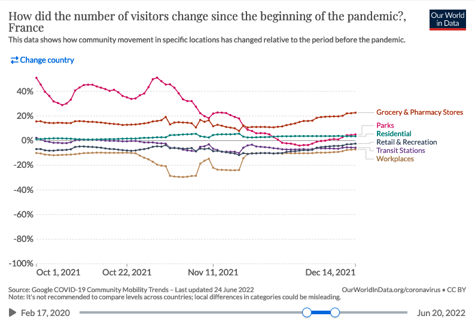{width="500"}

</center>


</details>

## 9. December 2021, second delta wave

<details>

<summary>

**Contexte**

</summary>

In the context of a second delta wave, Pasteur Institute produced 2 reports on [November 29](https://modelisation-covid19.pasteur.fr/scenarios/Institut_Pasteur_diminution_de_limmunit%C3%A9_et_rappel_20211129.pdf) and [December 2, 2021](https://modelisation-covid19.pasteur.fr/scenarios/Institut_Pasteur_Complement_rapport_rappel_20211202.pdf) with scenarios covering winter and spring 2022. Unfortunately, the emergence of the omicron variant 2 weeks later renders the hypotheses obsolete and does not allow a comparison with reality.

A criticism often made of the comparison of real data to "scenarios" as performed above is that the latter are not "predictions", and simply serve to give an idea of the major trends and impact of different measures.

Nevertheless, beyond the scenarios presented in its reports, the Institut Pasteur also publishes "Short-term projections of hospital needs" on [this page](https://modelisation-covid19.pasteur.fr/realtime-analysis/hospital/) , which are regularly updated. Here, the goal is indeed to correctly forecast the number of patients, the Institute stating that "the relative error for projections of the number of critical care beds at the national level is 11% at 14 days."

Here we compare the model projection 2 weeks before the peak of the second delta wave in mid-December 2021. This peak occurred just before the emergence of the omicron variant, which changed the game in the weeks that followed.

</details>

<details>

<summary>

**Comparison of scenarios to actual data**.

</summary>

At the time of the peak of the delta variant, the model projection corresponds to an overestimation 2 weeks later of 30% for critical care beds, and of about 40% for the other indicators.

Despite an average model accuracy of 10%, at the time of the peak the actual error will have been much higher. We would have liked to compare the model projections to the other peaks (February 2021, April 2021, August 2021) in order to assess whether this was a one-time error or a systematic bias on the peaks. Such an evaluation is important because it is the anticipation of a hospital peak that conditions most of the policy response.

Unfortunately, the regular updating of projections on the [page presenting the results](https://modelisation-covid19.pasteur.fr/realtime-analysis/hospital/) overwrites previously published projections, and we were unable to make this systematic assessment. Keeping previous results in open data would help such an approach and an appropriation of the results by citizens.

</details>

### {.tabset .tabset-fade .tabset-pills}

#### ICU Beds

```{r 2021-12-06_ICU_bed Pasteur}
#Lits en soins critiques
#+30% à 14 jours
scenario <- read.csv("data/2021_12_06_projection_pasteur/beds_SC.csv", sep=";") %>%
  mutate(date = as.Date(date, format = "%d/%m/%Y", optional = T))
ggplot(data = scenario, aes(x = date)) +
  geom_smooth(aes(y=projection, color="projection"), size=1, se=F) +
  geom_line(aes(y=reality, color = " réalité"), size=1) +
  annotate('text', x = as.Date("2021-12-08"), y = 3700, label = "2 weeks projections\noverestimation +30%", color = '#515a5a', fontface = "italic",
           family = "Times New Roman") +
  annotate('text', x = as.Date("2021-12-15"), y = 2500, label = "reality", color = myred, fontface = "bold",
          family = "Times New Roman") + 
  xlim(date("2021-11-01"), date("2021-12-20")) + g_theme + ylim(0, NA) +
  labs(title = "Intensive Care Unit Beds",
       subtitle = "Pasteur Institute projection December 6, 2021\n",
       caption = "\ntwitter : @Covid_Scenarios")
```

#### Hospital Beds

```{r 2021-12-06_hosp_bed Pasteur}
#Lits l'hopital
#+40%
scenario <- read.csv("data/2021_12_06_projection_pasteur/beds_hosp.csv", sep=";") %>%
  mutate(date = as.Date(date, format = "%d/%m/%Y", optional = T))
ggplot(data = scenario, aes(x = date)) +
  geom_smooth(aes(y=projection, color="projection"), size=1, se=F) +
  geom_line(aes(y=reality, color = " réalité"), size=1) +
  annotate('text', x = as.Date("2021-12-07"), y = 11000, label = "2 weeks projections\noverestimation +40%", color = '#515a5a', fontface = "italic",
           family = "Times New Roman") +
  annotate('text', x = as.Date("2021-12-12"), y = 6900, label = "reality", color = myred, fontface = "bold",
           family = "Times New Roman") +
  xlim(date("2021-11-01"), date("2021-12-20")) + g_theme + ylim(0, NA) +
  labs(title = "Hospital Beds",
       subtitle = "Pasteur Institute projection December 6, 2021\n",
       caption = "\ntwitter : @Covid_Scenarios")
```

#### ICU Admissions

```{r 2021-12-06_ICU_adm Pasteur}
#Admissions en soins critiques
#+45%
scenario <- read.csv("data/2021_12_06_projection_pasteur/new_SC.csv", sep=";") %>%
  mutate(date = as.Date(date, format = "%d/%m/%Y", optional = T))
ggplot(data = scenario, aes(x = date)) +
  geom_smooth(aes(y=projection, color="projection"), size=1, se=F) +
  geom_line(aes(y=reality, color = " réalité"), size=1) +
  annotate('text', x = as.Date("2021-12-05"), y = 350, label = "2 weeks projections\noverestimation +45%", color = '#515a5a', fontface = "italic",
           family = "Times New Roman") + 
  annotate('text', x = as.Date("2021-12-12"), y = 230, label = "reality", color = myred, fontface = "bold",
           family = "Times New Roman") +
  xlim(date("2021-11-01"), date("2021-12-20")) + g_theme + ylim(0, NA) +
  labs(title = "Daily Intensive Care Units Admissions",
       subtitle = "Pasteur Institute projection December 6, 2021\n",
       caption = "\ntwitter : @Covid_Scenarios")
```

#### Hospital Admissions

```{r 2021-12-06_hosp_adm Pasteur}
#Admissions journalières à l'hopital
#+40% à 14 jours
scenario <- read.csv("data/2021_12_06_projection_pasteur/new_hosp.csv", sep=";") %>%
  mutate(date = as.Date(date, format = "%d/%m/%Y", optional = T))
ggplot(data = scenario, aes(x = date)) +
  geom_smooth(aes(y=projection, color="projection"), size=1, se=F) +
  geom_line(aes(y=reality, color = " réalité"), size=1) +
  annotate('text', x = as.Date("2021-12-05"), y = 1420, label = "2 weeks projections\noverestimation +40%", color = '#515a5a', fontface = "italic",
           family = "Times New Roman") + 
  annotate('text', x = as.Date("2021-12-10"), y = 900, label = "reality", color = myred, fontface = "bold",
           family = "Times New Roman") +
  xlim(date("2021-11-01"), date("2021-12-20")) + g_theme + ylim(0, NA) +
  labs(title = "Daily Hospital Admissions",
       subtitle = "Pasteur Institute projection December 6, 2021\n",
       caption = "\ntwitter : @Covid_Scenarios")
```

###

<details>

<summary>

**Discussion of scenario assumptions (technical)**

</summary>

There is no need to check the assumptions for these projections. The two-week horizon is too short for any measure implemented after publication to modify the epidemic trajectory. Indeed, as the [Scientific Council Report](https://solidarites-sante.gouv.fr/IMG/pdf/avis_conseil_scientifique_12_mars_2020.pdf) states, "the first effects of the measures adopted [...] can only appear after two to three weeks".

</details>

## 10. January 2022, Omicron variant

<details>

<summary>

**Context**

</summary>

Following the appearance of the Omicron variant, the Pasteur Institute published a [first report on December 27, 2021](https://modelisation-covid19.pasteur.fr/variant/Institut_Pasteur_Impact_dOmicron_sur_lepidemie_francaise_20211227.pdf), presenting more than a hundred scenarios. Indeed, it is specified that "given the uncertainties [...], it is not possible to quantify precisely the impact that the Omicron wave will have". Therefore, we did not analyze this report.

The [following report of January 7](https://modelisation-covid19.pasteur.fr/variant/InstitutPasteur_Complement_Analyse_Impact_Omicron_20220107_corrige.pdf) takes as a basis the previous one in the light of the new data, and excludes the scenarios that do not fit the Omicron properties, making it possible to analyze the results.

We also analyze a [report published on February 15](https://modelisation-covid19.pasteur.fr/variant/Institut_Pasteur_Comparaison_Observations_projections_Omicron_20220215.pdf), which is a self-assessment comparing what was "predicted" (the term used by the report) with what actually happened.

</details>

<details>

<summary>

**Comparison of scenarios to actual data**

</summary>

The report distinguished "likely" scenarios (first ones presented) to "less likely" scenarios (below). It also distinguished between vaccine booster dose efficacy of 85% or 60% (for the first 6 months).

The reality is an initial vaccine efficacy of about 50% and then 0% after 3 months (see paragraph "Institut Pasteur's self-evaluation"). Thus, we should have excluded at least the 85% scenario, and kept the 60% scenario. However, since the Institut Pasteur only reports the 85% scenario in its self-assessmen to affirm that "the predicted and observed dynamics of daily admissions are close", we have chosen to also represent it.

</details>

<center>**Likely Scenarios**</center>

### {.tabset .tabset-fade .tabset-pills}

#### (Less) false assumption: 60% vaccine effectiveness

```{r 2022-01-07_probable_high_VE_Pasteur}
#low VE
scenario <- read.csv("data/2022_01_07_Pasteur/beds_SC_low_VE.csv", sep=";") %>%
  mutate(date = as.Date(date, format = "%d/%m/%Y", optional = T)) %>%
  gather(key=scenarios, value = value, -date)
scenario %>%
  ggplot(aes(date, value, group=scenarios)) +
  geom_line(data= scenario, 
            aes(x=date, value, group=scenarios), color = mygrey, size=1) +
  geom_line(data= true_data_beds_hosp_rea, 
            aes(x=date, y=rea, color = myred, group="réalité"), size=1) +
  annotate('text', x = as.Date("2022-01-20"), y = 2800, label = "reality", color = myred, fontface = "bold",
           family = "Times New Roman") +
  annotate('text', x = as.Date("2022-03-20"), y = 4400, label = "scenarios", color = mygrey, fontface = "bold",
           family = "Times New Roman") +
  xlim(date("2021-12-01"), date("2022-04-01")) + ylim(0,8000) +
  labs(title = "Intensive Care Unit Beds",
       subtitle = "scenarios published by the Pasteur Institute on January 7, 2022\n",
       caption = "\ntwitter : @Covid_Scenarios")
```

#### False assumption: 85% vaccine effectiveness

```{r 2022-01-07_probable_low_VE_Pasteur}
#high VE
scenario <- read.csv("data/2022_01_07_Pasteur/beds_SC_high_VE.csv", sep=";") %>%
  mutate(date = as.Date(date, format = "%d/%m/%Y", optional = T)) %>%
  gather(key=scenarios, value = value, -date)
scenario %>%
  ggplot(aes(date, value, group=scenarios)) +
  geom_line(data= scenario, 
            aes(x=date, value, group=scenarios), color = mygrey, size=1) +
  geom_line(data= true_data_beds_hosp_rea, 
            aes(x=date, y=rea, color = myred, group="réalité"), size=1) +
  annotate('text', x = as.Date("2022-01-20"), y = 2800, label = "reality", color = myred, fontface = "bold",
           family = "Times New Roman") +
  annotate('text', x = as.Date("2022-03-20"), y = 4400, label = "scenarios", color = mygrey, fontface = "bold",
           family = "Times New Roman") +
  xlim(date("2021-12-01"), date("2022-04-01")) + ylim(0,8000) +
  labs(title = "Intensive Care Unit Beds",
       subtitle = "scenarios published by the Pasteur Institute on January 7, 2022\n",
       caption = "\ntwitter : @Covid_Scenarios")
```

###

<center>**Less likely scenarios**</center>

### {.tabset .tabset-fade .tabset-pills}

#### (Less) false assumption: 60% vaccine effectiveness

```{r 2022-01-07_not_probable_high_VE_Pasteur}
#high VE all
scenario <- read.csv("data/2022_01_07_Pasteur/beds_SC_peu_probable_low_VE.csv", sep=";") %>%
  mutate(date = as.Date(date, format = "%d/%m/%Y", optional = T)) %>%
  gather(key=scenarios, value = value, -date)
scenario %>%
  ggplot(aes(date, value, group=scenarios)) +
  geom_line(data= scenario, 
            aes(x=date, value, group=scenarios), color = mygrey, size=1) +
  geom_line(data= true_data_beds_hosp_rea, 
            aes(x=date, y=rea, color = myred, group="réalité"), size=1) +
  annotate('text', x = as.Date("2022-01-20"), y = 2800, label = "reality", color = myred, fontface = "bold",
           family = "Times New Roman") +
  annotate('text', x = as.Date("2021-12-25"), y = 5800, label = "scenarios", color = mygrey, fontface = "bold",
           family = "Times New Roman") +
  xlim(date("2021-12-01"), date("2022-04-01")) + ylim(0,11000) +
  labs(title = "Intensive Care Unit Beds",
       subtitle = "scenarios published by the Pasteur Institute on January 7, 2022\n",
       caption = "\ntwitter : @Covid_Scenarios")

```

#### False assumption: 85% vaccine effectiveness

```{r 2022-01-07_not_probable_low_VE_Pasteur}
#high VE all
scenario <- read.csv("data/2022_01_07_Pasteur/beds_SC_peu_probable_high_VE.csv", sep=";") %>%
  mutate(date = as.Date(date, format = "%d/%m/%Y", optional = T)) %>%
  gather(key=scenarios, value = value, -date)
scenario %>%
  ggplot(aes(date, value, group=scenarios)) +
  geom_line(data= scenario, 
            aes(x=date, value, group=scenarios), color = mygrey, size=1) +
  geom_line(data= true_data_beds_hosp_rea, 
            aes(x=date, y=rea, color = myred, group="réalité"), size=1) +
  annotate('text', x = as.Date("2022-01-20"), y = 2800, label = "reality", color = myred, fontface = "bold",
           family = "Times New Roman") +
  annotate('text', x = as.Date("2021-12-25"), y = 5800, label = "scenarios", color = mygrey, fontface = "bold",
           family = "Times New Roman") +
  xlim(date("2021-12-01"), date("2022-04-01")) + ylim(0,11000) +
  labs(title = "Intensive Care Unit Beds",
       subtitle = "scenarios published by the Pasteur Institute on January 7, 2022\n",
       caption = "\ntwitter : @Covid_Scenarios")
```

###


<details>

<summary>

**Political and media impact**

</summary>

The Pasteur Institute self-evaluation was forwarded to the Senators as part of their inquiry about [the adequacy of the vaccine pass to the evolution of the covid-19 epidemic](https://www.senat.fr/rap/r21-537/r21-5371.pdf). It is stated that "the projections of the Pasteur Institute have turned out to be within the anticipated ranges". We detail in the following section the reasons why we think this statement is seriously challenged. Moreover, there is no mention of other past scenarios when the Pasteur Institute was completely wrong, for instance in [August 2021 with the sanitary pass](https://evaluation-modelisation-covid.github.io/france_eng/index.html#august-2021-4th-wave-and-delta-variant)

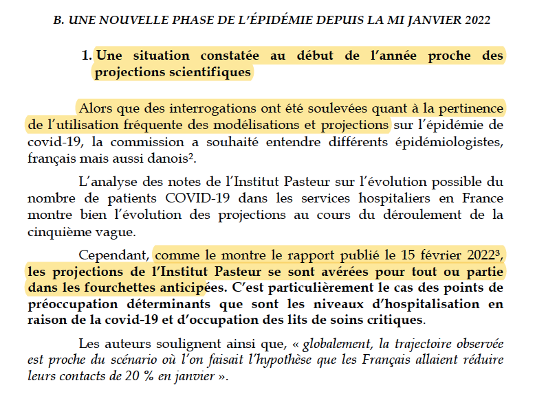{width="500"}


The Pasteur Institut's self-evaluation report was also quoted in [some press articles](https://www.huffingtonpost.fr/entry/institut-pasteur-avait-vu-juste-pour-la-5e-vague-voici-ses-predictions-sur-la-fin-de-lhiver_fr_620d0102e4b05706db70a281) as saying that "Institut Pasteur was almost about the impact of Omicron". 

</details>

<details>

<summary>

**Institut Pasteur self-assessment and discussion of hypotheses**

</summary>

Several points raise questions in the self-evaluation conducted by the Institut Pasteur presented below. We note in passing that our own retrospective is consistent with the figure presented by the Institute.

<center>

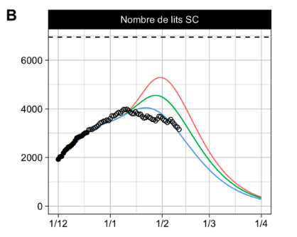{width="400"}

</center>

The most obvious one is the total absence of any reference to vaccine efficacy and the choice to represent only the curves illustrating a vaccine efficacy of 85%, contrary to our graphs. However, an [official note from DREES](https://drees.solidarites-sante.gouv.fr/communique-de-presse/au-dela-de-trois-mois-la-dose-de-rappel-ne-semble-plus-proteger-contre-les) explicitly states:

> *"Beyond three months, the booster dose no longer seems to protect against Covid-19 infections "*

At the time of publication of the report, the [British surveillance data](https://assets.publishing.service.gov.uk/government/uploads/system/uploads/attachment_data/file/1052353/Vaccine_surveillance_report_-_week_5.pdf) already indicated a vaccine efficacy of only 50% after 10 weeks, far from 85%. [Their more recent data](https://assets.publishing.service.gov.uk/government/uploads/system/uploads/attachment_data/file/1083443/Vaccine-surveillance-report-week-24.pdf) (below) confirm an initial efficacy of 45% and then almost zero after 3 months. 

<center>

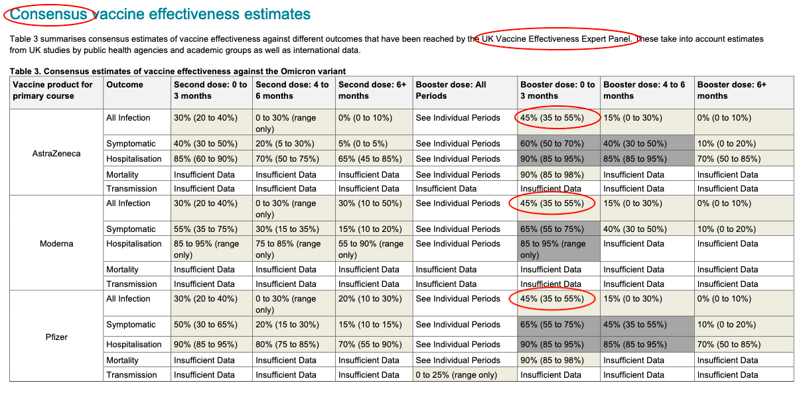{width="500"}

</center>

Even journalists correctly identified as early as January 13 that a 85% protection against infections is a ["largely incorrect figure"](https://www.liberation.fr/checknews/la-vaccination-avec-rappel-reduit-elle-les-infections-de-85-face-a-omicron-comme-laffirme-olivier-veran-20220113_VF5GJUFTRVCV5J3RANQGJOQMKY/).Could Pasteur's team have been unaware of these elements at the time of their self-evaluation?

Moreover, unlike us, the self-evaluation does not present the "less likely" scenarios. This raises the question of good practice in retrospective evaluation, to be defined upstream. Would the team have discarded these scenarios if reality had followed them?

We note that while the team regularly insists that ["the scenarios are not predictions"](https://www.liberation.fr/sciences/2020/11/03/simon-cauchemez-le-pic-de-cette-vague-en-reanimation-devrait-arriver-mi-novembre_1804291/), the self-assessment is less cautious, with the term "predicted" recurring several times in the report, e.g., "the predicted and observed dynamics of daily admissions are also close."

We recall that testing the adequacy of assumptions is important, because as the beginning of each of the Institut Pasteur reports reminds us:

> The trajectories described depend on the assumptions made; if the assumptions are not realized, the observed dynamics may differ from the projections.

Yet the Pasteur Institute did not apply its own statement to itself concerning its vaccine efficacy assumption. 

</details>
